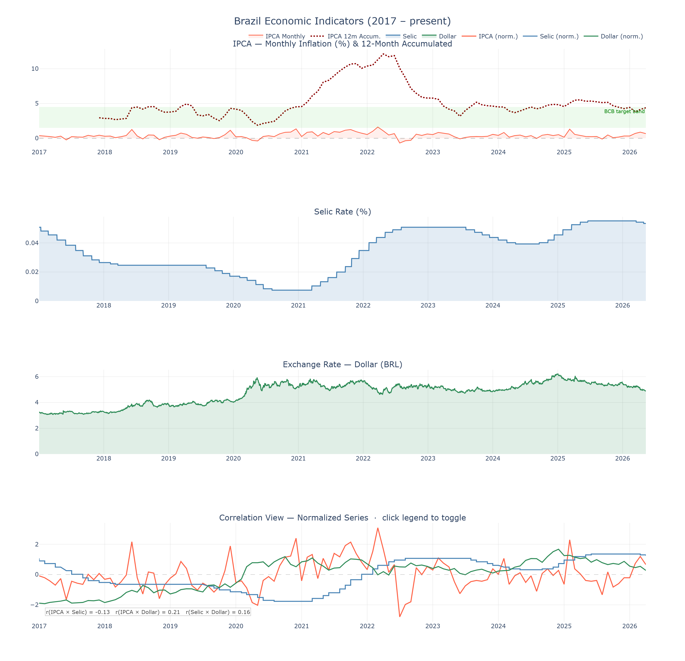

# 🇧🇷 Brazil Economic Indicators

Interactive visualization of Brazil's key macroeconomic indicators — IPCA, Selic and Dollar exchange rate — sourced directly from the **Central Bank of Brazil (BCB) public API**, with no authentication required.

---

## 📊 Preview

> Three synchronized interactive charts rendered in your browser, with rich hover tooltips showing current value, all-time highs/lows, and YTD accumulated rates.



---

## 📈 Indicators

| Indicator | BCB Code | Description |
|-----------|----------|-------------|
| **IPCA** | 433 | Brazil's official monthly inflation index |
| **Selic** | 11 | Brazil's benchmark interest rate (set by COPOM) |
| **Dollar** | 1 | BRL/USD daily exchange rate |

All data is fetched live from:
```
https://api.bcb.gov.br/dados/serie/bcdata.sgs.{CODE}/dados?formato=json
```

---

## ✨ Features

- **Live data** — pulls directly from the BCB API at every run, no manual downloads needed
- **Interactive charts** — built with Plotly; zoom, pan and hover across all three charts simultaneously thanks to a shared X axis
- **Rich hover tooltips:**
  - IPCA: current monthly value + all-time high & low with dates
  - Selic: current rate + YTD accumulated rate (compound formula)
  - Dollar: current rate + all-time high & low with dates
- **Statistical summary** printed to the console:
  - Accumulated IPCA for the previous year
  - Dollar all-time peak with date
  - Average Selic rate broken down by year
- **Exports** a standalone `brazil_indicators_interactive.html` file — share it with anyone, no Python needed to view it

---

## 🗂️ Project Structure

```
brazil-economic-indicators/
│
├── brazil_economic_indicators.py   # Main script
├── brazil_indicators_interactive.html  # Generated chart (open in any browser)
├── imagens/
│   └── indicadores.png             # Static preview for the README
└── README.md
```

---

## 🚀 Getting Started

**1. Clone the repository**
```bash
git clone https://github.com/valeeeeeeeeeeeeee/brazil-economic-indicators.git
cd brazil-economic-indicators
```

**2. Install dependencies**
```bash
pip install requests pandas numpy plotly
```

**3. Run the script**
```bash
python brazil_economic_indicators.py
```

The chart will open automatically in your default browser, and an HTML file will be saved in the project folder.

---

## 🔧 Requirements

- Python 3.8+
- Internet connection (to reach the BCB API)

Dependencies are intentionally minimal — no API key, no sign-up, no local database.

---

## 💡 How It Works

### Fetching data
The `fetch_series()` function builds the BCB API URL from a series code, requests the JSON payload, and returns a clean pandas DataFrame with typed `date` and value columns.

### Cumulative Selic
The YTD accumulated Selic is computed using the compound interest formula, reset every January:

```python
selic["Selic_Cumulative"] = (
    selic.groupby("year")["Selic"]
         .transform(lambda x: ((1 + x / 100).cumprod() - 1) * 100)
)
```

### Min/Max in hover tooltips
Because Plotly's hover system is point-indexed, global stats (all-time high/low) are broadcast across every row using `np.full` and stacked into `customdata` with `np.column_stack` — making them available on every hover without creating extra visible traces.

---

## 🧠 Skills Demonstrated

- Consuming a real public REST API without third-party wrappers
- Data cleaning and type coercion with **pandas**
- Compound interest calculation with **numpy**
- Multi-panel interactive data visualization with **Plotly**
- Advanced hover tooltip customization via `customdata`
- Clean, well-commented and modular Python code

---

## 📄 License

MIT — feel free to use, adapt and share.